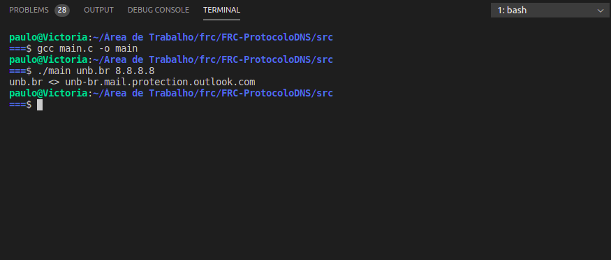
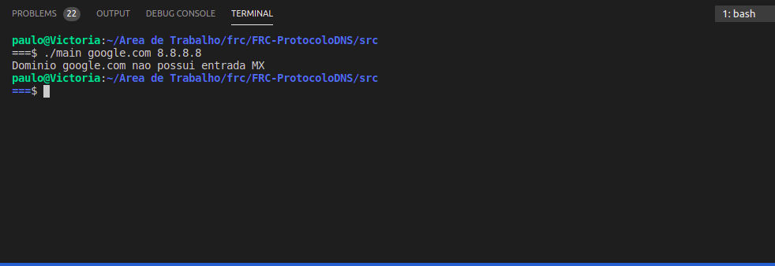
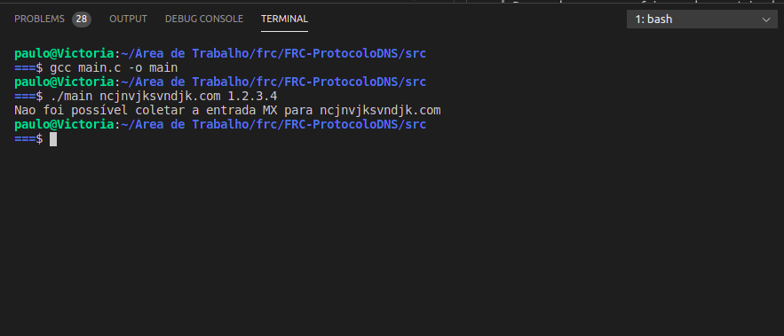

# Programação de Sockets

**Fundamentos de Redes de Computadores - Trabalho 01 / 2020-1**  
**Professor:** Tiago Alves  
**Alunos:**  
Ailamar Alves Guimarães - 160022673  
Matheus Amaral Moreira  - 170080307

## Introdução  

Este documento tem o intuito de informar e descrever as atividades feitas no decorrer do Trabalho 01 de FRC. Nesse projeto foi implementado o Protocolo DNS de registro MX apenas do Cliente, tanto a parte de envio da mensagem DNS, quanto de tradução da resposta.

## Sistema operacional

De acordo como o que foi passado no roteiro do trabalho, concluímos que o modo mais eficaz, baseado no conhecimento da dupla, seria fazer o projeto em Linguagem C com as bibliotecas do GNU/Linux, no caso o Ubuntu. Porém, com algumas limitações de um dos integrantes, foi necessário utilizar o Windows 10 também.

## Ambiente de desenvolvimento

Para o desenvolvimento do projeto foram utilizadas as ferramentas listadas na tabela seguinte:

|    |    |
 ----|:---
**GitHub** | Essa plataforma foi utilizada para armazenamento, integração e controle de versões trabalho.
**Discord** | O Discord foi útil para a dupla realizar o pareamento durante a programação, através de chamadas devido ao afastamento social já que os integrantes não poderiam se encontrar.
**WhatsApp** | Para comunicação mais rápida, marcar horário para reunir e passar qualquer informação que aparecer sobre o projeto.
**Visual Studio Code / CLion**| IDE's utilizadas no desenvolvimento da documentação e código.
**Wireshark** | Usado para analisar e entender os tráfegos de rede e a organização dos protocolos.

## Construção da aplicação

Devido alguns acontecimentos no início do desenvolvimento, a estrutura do código acabou tendo uma função main monolítica.

O desenvolvimento da aplicação consistiu nos seguintes desafios:

* Construção e formatação dos dados DNS MX segundo a RFC 1035, Page: 25;
    * Header: ID (2 bytes); Flags (2 bytes); Questions Count (2 bytes); Answer Count (2 bytes); Authority Count (2 bytes); Additional Count (2 bytes).
    * Question: Question Name (tamanho da mensagem + 1 bytes); Question Type (2 bytes); Question Class (2 bytes).
    * Answer: Name (2 bytes); Type (2 bytes); Class (2 bytes); Time To Live (4 bytes); Data Length (2 bytes); Preference (2 bytes); MX Data (Data Length - 2 bytes). 
* Estabelecer conexão com o socket, o envio <sendto()> e a recepção <recvfrom()> usando o protocolo UPD;
* Fazer um algoritmo de tradução dos dados para o formato de envio;
* Fazer um algoritmo de tradução dos dados do formato recebido para o formato legível;
* Responder segundo as expecificações `unb.br <> unb-br.mail.protection.outlook.com`

### Exemplo de mensagem do cliente

```
a0 24 01 00 00 01 00 00 00 00 00 00 03 75 6e 62 02 62 72 00 00 0f 00 01

Header: a0 24, 01 00, 00 01, 00 00, 00 00, 00 00;
Query: [03 75 6e 62 02 62 72 00], 00 0f, 00 01;
```

### Exemplo de resposta do servidor

```
a0 24 81 80 00 01 00 01 00 00 00 00 03 75 6e 62 02 62 72 00 00 0f 00 01 c0 0c 00 0f 00 01 00 00 34 dd 00 26 00 00 06 75 6e 62 2d 62 72 04 6d 61 69 6c 0a 70 72 6f 74 65 63 74 69 6f 6e 07 6f 75 74 6c 6f 6f 6b 03 63 6f 6d 00

Header: a0 24, 81 80, 00 01, 00 01, 00 00, 00 00;

Query: [03 75 6e 62 02 62 72 00], 00 0f, 00 01;

Anser: |c0 0c, 00 0f, 00 01, 00 00 34 dd, *00 26*, 00 00, [06 75 6e 62 2d 62 72 04 6d 61 69 6c 0a 70 72 6f 74 65 63 74 69 6f 6e 07 6f 75 74 6c 6f 6f 6b 03 63 6f 6d 00]|;
```

## Como executar a aplicação

Abra um terminal na pasta que deseja salvar o trabalho e execute os seguintes passos:

Clonar o repositório:

```
git clone https://github.com/ailamaralves/FRC-ProtocoloDNS.git
```

Compilar:

```
gcc main.c -o
```  

Executar:

```
./main unb.br 8.8.8.8
```

## Instruções de uso

Estando dentro da pasta do executável, abra um terminal e digite no formato:

```
./arquivo_compilado.exe [host_name] [server_IP]

host_name       O nome cuja a resolução se procura

server_IP       O IP do servidor DNS que será consultado
```

Caso precise dessa tela, digite `-help` na frente do arquivo.

## Resultados possíveis 

- Resolução bem sucedida 

<br/>

- Resolução com falha: nome de domínio não existe ou não foi encontrado

<br/>

- Resolução com falha: domínio não possui entrada MX


## Limitações

### Limitações de desenvolvimento
Algumas dificuldades foram encontradas no decorrer do projeto, já que era uma área nova de produção para ambos da dupla.
Inicialmente foi necessário estudar os documentos disponibilizados pelo professor e fazer algumas pesquisas para se familiarizar melhor com o assunto.  
Outra questão que nos limitou durante o desenvolvimento foi o fato de um dos membros ter tido problema em sua máquina com o GNU/Linux, dificultando na hora de testar e rodar o projeto mas ainda assim com apenas uma máquina para executar deu certo.

### Limitação de execução

* O código só será compilado por um sistema GNU/Linux, pois nenhuma versão do Windows possui as bibliotecas <netinet/in.h>, <arpa/inet.h>, <sys/socket.h>, <unistd.h>.
* É necessário ter internet.

## Observações


## Referências

- DNS: RFC 1034. Disponível em: <https://aprender3.unb.br/pluginfile.php/235919/mod_resource/content/1/rfc1034.pdf>. Acesso em out. 2020.
- DNS: RFC 1035. Diponível em: <https://aprender3.unb.br/pluginfile.php/235920/mod_resource/content/2/rfc1035.pdf>. Acesso em out. 2020.
- DNS QUERY MESSAGE FORMAT. Disponível em: <http://www.firewall.cx/networking-topics/protocols/domain-name-system-dns/160-protocols-dns-query.html>. Acesso em out. 2020.
- C library. Disponível em <http://www.cplusplus.com/reference/clibrary/>. Acesso em out. 2020.
